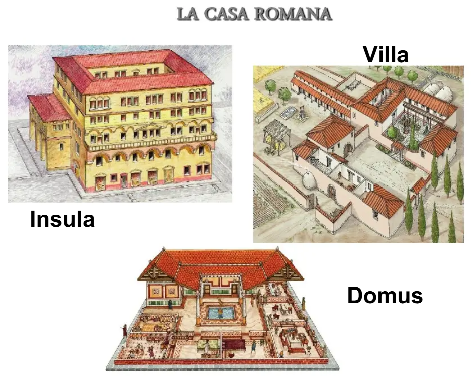

# Funcionamiento de Sistemas-Civilizaciones: La Civilización Romana

## Índice
- [Visión General de la Civilización](Sistemas-civilizaciones.md)
- [Obtención de Materia](RomanosMateriales.md)
- [Obtención de Energía](RomanosEnergia.md)

<!-- Falta por desarrollar aun mas -->
## Condiciones adecuadas para la vida

### **Suministro y saneamiento**
- Red de **agua potable** y fuentes públicas.
- **Termas**: higiene, bienestar y socialización.
- **Alcantarillado urbano** y letrinas públicas.

### **Vivienda**
- **Viviendas Urbanas:**
    - <u>Domus</u>: casas con patios, calefacción y cisternas.
    - <u>Insulae</u>: edificios para clases populares, más densos y con riesgos de incendio.
- **Viviendas de Campo:**
    - <u>Villae</u>: Residencias de Campo: grandes haciendas rurales que servían como centro de explotación agrícola y ganadera para la élite terrateniente.
    - <u>Casae</u>: Viviendas primitivas: Usadas por clases bajas y esclavos, construidas con medios muy precarios.
    

### **Salud y alimentación**
- Dieta mediterránea equilibrada (pan, aceite, vino, legumbres).
- Medicina romana (influencia de Galeno y la tradición griega).
- Protección militar y administración pública.