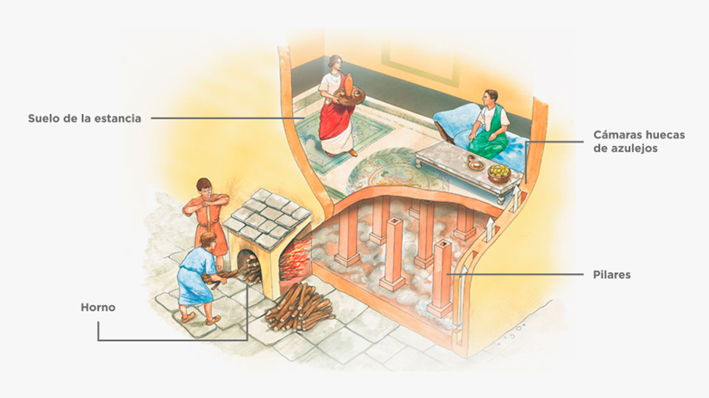

# Funcionamiento de Sistemas-Civilizaciones: La Civilización Romana

## Energía: fuentes y usos
La civilización romana no utilizaba combustibles fósiles, por lo que su sistema energético se basaba principalmente en fuentes naturales renovables y en la fuerza física de personas y animales. Estas fuentes permitieron sostener la agricultura, la industria, el transporte y la vida urbana.

### **Fuentes principales**
- <u>Energía humana y animal</u>: base del trabajo agrícola y urbano.
- <u>Leña y carbón vegetal</u>: principal fuente térmica.
- <u>Energía hidráulica</u>: maquinaria y molinos de agua (para moler grano).
- <u>Energía eólicaz</u>: navegación marítima.
- <u>Aceite de oliva</u>: iluminación doméstica y iluminar lámparas.

### **Ejemplo de Usos**
- Industria metalúrgica y cerámica, que requería altas temperaturas en hornos.
- Termas y sistemas de calefacción, como el hipocausto, que distribuía aire caliente bajo el suelo.
- Transporte terrestre y marítimo, mediante carros tirados por animales y barcos impulsados por velas y remos.

