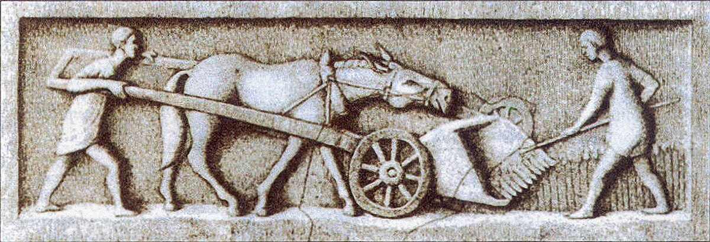
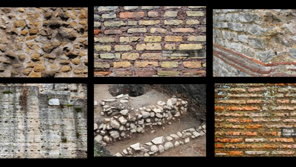

# Funcionamiento de Sistemas-Civilizaciones: La Civilización Romana

## Índice
- [Visión General de la Civilización](Sistemas-civilizaciones.md)
- [Obtención de Energía](RomanosEnergía.md)
- [Condiciones de vida](RomanosCondiciones.md)

## Como obtenian Materia

### **Alimentos**
- <u>Agricultura local</u>: cereales, olivos, viñedos y hortalizas (cultivo intensivo en llanuras y terrazas en colinas).
- Producción especializada por regiones (aceite de oliva en Hispania, vino en Grecia e Italia).
- Importaciones masivas: como el grano desde Egipto y África.
- Conservación mediante sal y curado.

### **Agua**
- <u>Acueductos</u>: transporte desde manantiales hasta ciudades (Ej. Acueducto Claudio).
- Cloacas y drenajes para aguas residuales.
- Pozos y cisternas rurales.

### **Materiales**
- <u>Piedra y mármol</u>: canteras locales y transportes marítimos.
- <u>Concreto romano</u> (opus caementicium): mezcla de cal y pozzolana (ceniza volcánica).
- <u>Metales</u>: hierro, plomo, plata, oro (minas en Hispania, Britania y Dacia).
- <u>Madera y carbón vegetal</u>: construcción, combustible y forja.
- <u>Sal</u>: esencial para conservar alimentos y como bien de cambio.

