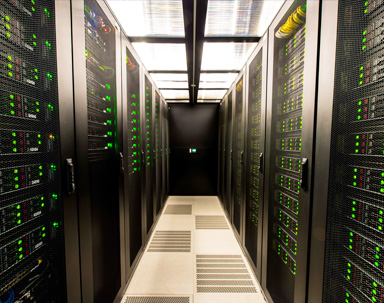

# Análisis del sector TIC en relación con los sistemas materiales, el consumo de recursos y la generación de residuos.

## Índice
- [Sistemas Materiales](#1-sistemas-materiales)
- [Consumo energético y de recursos](#2-consumo-energético-y-de-recursos-en-el-sector)
- [Generación de Residuos](#3-generación-de-residuos-e-waste)
- [Economía circular en el sector TIC](#4-economía-circular-en-el-sector-tic)

## Introducción
El sector de la informática y las comunicaciones (TIC) es uno de los más dinámicos y transformadores del mundo actual. Sin embargo, su rápido crecimiento implica un alto consumo de recursos materiales, producción intensiva de componentes electrónicos y una creciente generación de residuos tecnológicos (e-waste).
Por ello, el enfoque de la economía circular se ha convertido en un eje fundamental para reducir su impacto ambiental.

---

## 1. Sistemas Materiales
La industria informática requiere una gran variedad de materiales para fabricar dispositivos, servidores, redes y sistemas de almacenamiento.

### Materiales más utilizados
- <u>Metales comunes</u>: cobre, hierro, aluminio.
- <u>Tierras raras</u>: neodimio, europio, terbio (importante para imanes, pantallas LED y componentes de alta tecnología).
- <u>Metales preciosos</u>: oro, plata, paladio (presentes en placas electrónicas).
- <u>Materiales plásticos</u>: carcasas, aislamientos, cables.
- <u>Vidrios especiales</u>: pantallas, fibras ópticas.

### Problemas asociados a los sistemas materiales

- Escasez de recursos críticos por alta demanda.
- Impacto ambiental en la extracción, con alto uso de energía y agua.
- Producción global altamente concentrada, generando dependencias geopolíticas.
- Procesos de fabricación contaminantes, especialmente en semiconductores.

---

## 2. Consumo energético y de recursos en el sector
El consumo total del sector TIC continúa aumentando, impulsado por la digitalización global.

### Mayores consumidores de recursos
- <u>Centros de datos</u>: grandes consumidores de electricidad (alimentación + refrigeración).
- <u>Fabricación de hardware</u>: es la fase más intensiva en energía y materiales.
- <u>Dispositivos personales</u>: millones de unidades producidas y reemplazadas cada año.
- <u>Infraestructuras de red</u>: antenas, fibra óptica y equipos de telecomunicación.

### Datos relevantes
- El 80% del impacto ambiental de un dispositivo se produce antes de que llegue al usuario (extracción + fabricación).
- Los centros de datos representan ya entre el 1% y 3% del consumo energético mundial (cifra que va aumentando debido a la demanda de IA, la nube y IoT).

---

## 3. Generación de residuos (e-waste)
El sector TIC es uno de los principales generadores de residuos eléctricos y electrónicos (e-waste), un tipo de residuo complejo y altamente contaminante.

### Características del e-waste
- Contiene materiales valiosos (oro, cobre, aluminio, metales raros) y sustancias tóxicas (plomo, cadmio, mercurio).
- Requiere procesos especializados para su reciclaje, además de ser costoso y complicado de separarlos.
- Alrededor de un 20% del e-waste mundial se recicla formalmente.

### Consecuencias ambientales
- Contaminación del suelo y del agua por metales pesados y tóxicos.
- Emisiones tóxicas por la incineración informal (emite gases contaminantes y aumenta el efecto invernadero).
- Riesgos para la salud de trabajadores en países en desarrollo donde se realiza reciclaje manual.

### 4. Economía circular en el sector TIC
La economía circular en el sector de las tecnologías de la información y comunicación (TIC) busca reducir el impacto ambiental mediante la **reutilización, reparación y reciclaje de dispositivos electrónicos**. En lugar de producir y desechar continuamente nuevos equipos, se fomentan prácticas como la recuperación de componentes, la actualización de hardware, el reacondicionamiento de computadoras y el reciclaje de materiales valiosos. De este modo, se aprovechan los recursos existentes, se minimizan los residuos electrónicos y se disminuye la extracción de materias primas, promoviendo un uso más sostenible y responsable de la tecnología.
